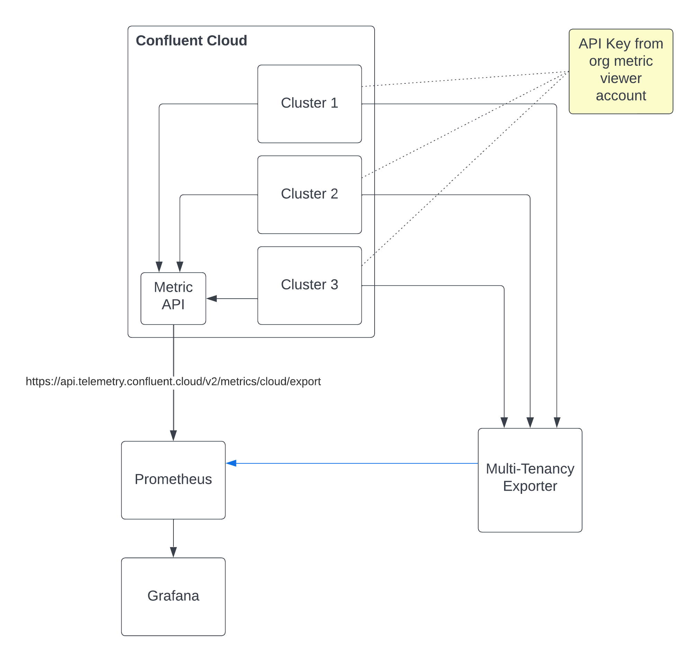

# Confluent Cloud Multi-tenancy metric exporter

## Overview

This project is created to parse existing cluster topic naming and determine the distribution for multi tenancy purpose for Confluent Cloud users.

In the current version, the exporter only support the following topic naming convention:

```
<CountryCode>.<Environment>.<BusinessDomain>.<Sub-Business Domain>.<FreeTextTopicName>
```



## Requirements

* Python 3
* Install all the packages listed in `requirements.txt`
* Create a service account which has a organisational <a href="https://docs.confluent.io/cloud/current/access-management/access-control/cloud-rbac.html#operator">Operator</a> role binding.

## Step to prepare

* Review the configuration in `client.yml`
 * List each Confluent Cloud cluster.
 * For each cluster, create an api-key per involved cluster. These api-key will associated to the same service account prepared.
* Review the configuration in `ksqlDB.yml`
 * This definition is to help identify ksqlDB internal topic ownership, if this feature not required, set `required` to false.
* Run this program as background or daemon service
* Reconfigure prometheus to start scraping the metric from the `port` _(default: 8000)_

## Note

* Both `client.yml` and `ksqlDB.yml` will be reloaded at the beginning of each scape trigger. This allow user to dynamically maintain the cluster definition without restarting the program.

## Future features

* Support custom separator
* Support custom topic naming convention
